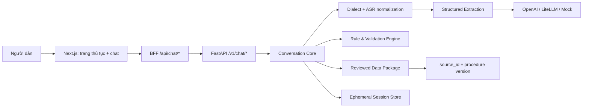
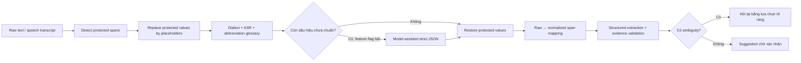

# VNeGuide — Trợ lý AI đồng hành điền hồ sơ dịch vụ công

> Người dân nói bằng ngôn ngữ đời thường; VNeGuide xác định đúng dịch vụ, hướng dẫn từng bước, đề
> xuất dữ liệu cho biểu mẫu và chờ người dùng xác nhận. AI không tự quyết định điều kiện hành chính,
> không tự ghi đè dữ liệu và không tự nộp hồ sơ.

## Tóm tắt giải pháp

VNeGuide là AI copilot chạy song song với biểu mẫu dịch vụ công. Sản phẩm giúp người dân đi từ câu
nói đời thường đến đúng dịch vụ, hiểu từng trường cần điền, nhận đề xuất có bằng chứng và hoàn thiện
bản nháp mà vẫn giữ toàn bộ quyền quyết định. Điểm khác biệt quan trọng là hệ thống có lớp **chuẩn
hóa phương ngữ tiếng Việt và lỗi nhận dạng giọng nói**: các cách nói như “tui ưng mần tạm trú” được
hiểu là “tôi muốn đăng ký tạm trú”, nhưng họ tên, CCCD, ngày sinh, địa chỉ, số điện thoại và mã hồ sơ
được bảo vệ để không bị sửa sai trong quá trình chuẩn hóa.

| Câu hỏi | Trả lời ngắn |
| --- | --- |
| Vấn đề | Người dân khó chọn đúng thủ tục, khó hiểu ngôn ngữ biểu mẫu và thường phát hiện thiếu hồ sơ quá muộn. |
| Người dùng ưu tiên | Người lớn tuổi, người ít am hiểu công nghệ và người lần đầu làm thủ tục trực tuyến. |
| AI làm gì? | Hiểu nhu cầu/phương ngữ, routing có xác nhận, trích xuất field có evidence và giải thích từng bước. |
| AI không làm gì? | Không quyết định điều kiện pháp lý, không tự ghi dữ liệu, không tự nộp hoặc phê duyệt hồ sơ. |
| Nguồn quyết định nghiệp vụ | Procedure pack, field catalog, 27 rule deterministic và 13 source entry đã review. |
| Phạm vi MVP | Đúng ba thủ tục: bản sao Giấy khai sinh, xác nhận điều kiện nhà ở và đăng ký tạm trú. |
| Bằng chứng chạy được | Public Vercel + Render, Python/frontend gates, browser E2E hero 5/5 và public model smoke. |
| Mức sẵn sàng | MVP đủ để trình diễn; chưa production/pilot-ready vì session chưa durable, chưa có DPIA/user validation/video backup. |

### Giá trị AI-Native trong một luồng

1. Người dân mô tả nhu cầu bằng tiếng Việt tự nhiên, phương ngữ, từ rút gọn hoặc transcript speech.
2. Lớp ngôn ngữ bảo vệ dữ liệu định danh, chuẩn hóa phần còn lại và giữ ánh xạ về câu gốc.
3. Agent đề xuất đúng một dịch vụ trong phạm vi và **bắt buộc người dùng xác nhận** trước điều hướng.
   Câu hỏi làm rõ và đổi dịch vụ có nút chọn lớn; người dùng không phải nhớ hoặc gõ câu lệnh.
4. Trên trang nộp hồ sơ, người dùng có thể tự điền hoặc nhờ agent hỏi/hướng dẫn từng trường.
5. Giá trị do AI tìm thấy chỉ là suggestion; người dùng Accept, Edit hoặc Reject trước khi vào draft.
6. Rule engine kiểm tra field bắt buộc, điều kiện, nguồn và trạng thái; LLM không được tự nhớ luật.
7. Khi model timeout hoặc session stale, biểu mẫu và dữ liệu local vẫn tiếp tục sử dụng được; OCR
   hiện mới ở chế độ candidate-only và luôn phải có fallback nhập tay.

Phạm vi runtime hiện hành được khóa bởi [`data/README.md`](data/README.md) và chỉ gồm:

- `2.000635`: Cấp bản sao Trích lục hộ tịch — bản sao Giấy khai sinh.
- `1.013314`: Xác nhận điều kiện diện tích bình quân nhà ở và tình trạng chỗ ở.
- `1.004194`: Đăng ký tạm trú.

Các tài liệu sản phẩm cũ trong `doc/` phải được đối chiếu với data package trước khi dùng để code. VNeGuide chỉ hỗ trợ hướng dẫn, kiểm tra và chuẩn bị hồ sơ; kết quả không phải quyết định hành chính.

## Demo công khai

- Web: [https://vneguide.vercel.app](https://vneguide.vercel.app)
- FastAPI health: [https://vneguide-api.onrender.com/health](https://vneguide-api.onrender.com/health)
- API production dùng provider `openai`, model `gpt-4o-mini`; secret chỉ nằm trong Render
  Environment, không nằm trong frontend hoặc repository.

Vercel chạy Next.js và các route BFF `/api/chat/*`; BFF gọi FastAPI trên Render, sau đó FastAPI mới
gọi model. Website là bản mô phỏng phục vụ hackathon, không phải Cổng Dịch vụ công và không tiếp
nhận CCCD, số điện thoại hoặc dữ liệu cá nhân thật.

Render Free có thể sleep khi không hoạt động, vì vậy request đầu tiên sau thời gian idle có thể chậm.
Session hiện lưu trong memory và sẽ mất khi Render restart, deploy hoặc spin down; đây chưa phải kiến
trúc lưu trữ bền vững cho tải thật. Trong cùng một backend session, cookie HttpOnly giữ nguyên cuộc
trò chuyện khi người dùng xác nhận dịch vụ và chuyển từ trang chủ sang trang thủ tục; lịch sử, dịch
vụ đang làm và đề xuất chưa xử lý không bị tạo lại chỉ vì điều hướng trang.

## Dành cho ban giám khảo — bản đồ chấm 100 điểm

README này phân biệt rõ ba lớp bằng chứng:

- **Đã triển khai:** có code, test hoặc public URL để kiểm tra ngay.
- **Đã kiểm chứng:** có lệnh chạy, số liệu và evidence trong repository.
- **Mục tiêu pilot:** là ngưỡng đề xuất cho thử nghiệm thực tế, chưa được trình bày như kết quả hiện có.

Audit khoảng trống và mức độ phủ evidence hiện tại được khóa tại
[`doc/operations/judging-readiness.md`](doc/operations/judging-readiness.md). Repo không đánh đồng
độ phủ bằng chứng nội bộ với điểm ban giám khảo hoặc mức sẵn sàng production.

| Tiêu chí | Điểm | Nội dung để kiểm tra nhanh | Bằng chứng chính |
| --- | ---: | --- | --- |
| Chất lượng triển khai kỹ thuật | 20 | Next.js BFF, FastAPI, core độc lập UI, state revisioned, CI và container smoke | [`src/vneguide/`](src/vneguide/), [`demoweb/`](demoweb/), [release evidence](doc/operations/release-evidence.md) |
| Kiến trúc AI-Native & đổi mới | 20 | Structured extraction, suggestion-first, chat–form shared state, deterministic guidance, multi-provider | [`src/vneguide/ai/`](src/vneguide/ai/), [`src/vneguide/core/`](src/vneguide/core/), [AI design](doc/AI%20%26%20Evaluation.md) |
| Khả thi kinh doanh & pilot | 20 | Bài toán, bên hưởng lợi, mô hình triển khai, pilot 12 tuần, KPI và điều kiện go/no-go | Mục 3 bên dưới |
| UX AI-Native & design thinking | 15 | Xác nhận dịch vụ, hỏi từng trường, lựa chọn lớn, Accept/Edit/Reject, fallback nhập tay | [`ChatWidget.tsx`](demoweb/src/components/chat/ChatWidget.tsx), [Product & UX](doc/Product%20and%20UX.md) |
| An toàn AI, grounding & tin cậy | 15 | 13 nguồn, 27 rule deterministic, strict schema, evidence, revision guard, PII/secret audit | [`data/catalog/`](data/catalog/), [`rules/`](src/vneguide/rules/), [`release_audit.py`](deployment/scripts/release_audit.py) |
| Trình bày & bảo vệ giải pháp | 10 | Demo công khai, hero flow, failure demo, số liệu, giới hạn và pitch 3 phút | [Demo & pitch](doc/operations/demo-and-pitch.md), [progress](doc/operations/progress.md) |

### Kịch bản chấm nhanh trong 5 phút

1. Mở [demo công khai](https://vneguide.vercel.app), bấm biểu tượng trợ lý và nhập “Tui ưng mần tạm
   trú”. Kiểm tra hệ thống hiểu phương ngữ/lỗi ASR thành nhu cầu đăng ký tạm trú, sau đó xác nhận đúng
   dịch vụ trước khi VNeGuide điều hướng sang trang thủ tục.
2. Chọn nơi tiếp nhận, mở luồng nộp hồ sơ và bấm **Nhờ trợ giúp** ở một bước. Prompt hướng dẫn được
   gửi ẩn; người dùng vẫn thấy câu trả lời và lựa chọn phù hợp với trường hiện tại.
3. Trả lời một trường lựa chọn trong chat. Kiểm tra rằng AI chỉ tạo đề xuất; biểu mẫu chỉ thay đổi sau
   Accept/Edit hoặc thao tác xác nhận rõ ràng.
4. Sửa một trường trực tiếp trên form. Revision/dirty-field guard giữ giá trị người dùng và ngăn
   phản hồi cũ ghi đè.
5. Hỏi “Lệ phí bao nhiêu?” hoặc “Mất bao lâu?”. Câu trả lời lấy từ procedure pack đã review, không
   cần LLM tự nhớ quy định.
6. Thử “Tôi muốn đăng ký khai sinh mới”. Hệ thống giải thích ngoài phạm vi thay vì ép vào dịch vụ gần
   giống.

## 1. Chất lượng triển khai kỹ thuật — 20 điểm

### Kiến trúc đang chạy



Production preview dùng Vercel cho Next.js/BFF và Render cho FastAPI. Model key chỉ tồn tại ở Render;
browser không gọi model trực tiếp. Local/release stack có thêm Nginx gateway và Docker Compose để
smoke toàn tuyến trước khi deploy.

| Lớp | Trách nhiệm | Ranh giới kỹ thuật |
| --- | --- | --- |
| `demoweb` | Điều hướng dịch vụ, biểu mẫu, chat, suggestion card và trạng thái UX | Không chứa API key hoặc business rule pháp lý |
| Next.js BFF | Giữ session ID trong cookie `HttpOnly`, chuẩn hóa timeout/error, gọi FastAPI server-side | Không đưa session/model key vào `NEXT_PUBLIC_*` |
| FastAPI | Contract HTTP, schema validation, session lifecycle và revisioned mutations | Không chứa logic giao diện |
| Conversation core | Điều phối nhiều lượt, câu hỏi kế tiếp, suggestion và state transition | Không phụ thuộc CLI/Next.js |
| AI adapter | Routing và trích xuất dữ liệu có cấu trúc từ lời người dùng | Không quyết định required field, phí hay căn cứ pháp lý |
| Rule engine | Required/conditional field, validation và trạng thái hồ sơ | Chỉ chạy handler deterministic đã review; không `eval` rule text |
| Data package | Procedure pack, field catalog, rule và nguồn | Là nguồn sự thật runtime; không sao chép JSON vào source |

### Contract chống mất đồng bộ chat–form

- `CaseDraft` có `revision`; mọi mutation suggestion/form phải gửi `expected_revision`.
- Response stale bị từ chối thay vì ghi đè state mới.
- Field sửa tay được đánh dấu `confirmed` và `dirty`; AI không được đề xuất ghi đè âm thầm.
- Tin nhắn dùng `client_turn_id` để retry idempotent mà không tăng revision biểu mẫu.
- Suggestion có vòng đời `pending → accepted/rejected/edited`; draft chỉ chứa giá trị đã xác nhận.
- Reset tạo session mới; session cũ trả `404`. Form có thể tiếp tục dùng khi AI timeout.

### Số liệu triển khai đã kiểm chứng

| Hạng mục | Kết quả hiện tại | Cách kiểm tra |
| --- | --- | --- |
| Python quality gate | Ruff, format, mypy strict đạt; `305 passed`, `2 skipped`; coverage `80.58%` | `python -m pytest --cov=vneguide --cov-report=term-missing` |
| Frontend gate | 22 unit test; ESLint, TypeScript và Next production build 25 route đạt | `cd demoweb && npm run check` |
| Browser E2E | `15 passed`, `1 skipped`; ba route, hero tạm trú 5/5, edit/stale/reset/recovery/timeout; OCR UI chưa có nên test được đánh dấu rõ | `cd demoweb && npm run test:e2e` |
| Dependency | `npm audit --audit-level=moderate` không có vulnerability ở lần release | Xem [release evidence](doc/operations/release-evidence.md) |
| Data contract | 44 field: tạm trú 15, nhà ở 16, bản sao khai sinh 13 | `jq 'group_by(.procedure_code)' data/catalog/field_catalog.json` |
| Rule contract | 27 rule: tạm trú 10, nhà ở 8, bản sao khai sinh 9 | `jq 'group_by(.procedure_code)' data/catalog/validation_rules.json` |
| Evaluation data | 75 ca JSONL tổng hợp, gồm 17 ca phương ngữ/ASR/protected span | [`data/evaluation/`](data/evaluation/), [`tests/evals/`](tests/evals/) |
| CI | Python, web, container smoke và Vercel đều pass trên PR release | [progress 2026-07-19](doc/operations/progress.md) |
| Public E2E | Tạo session `201`; message qua Vercel → Render → OpenAI `200` | [release evidence](doc/operations/release-evidence.md) |

## 2. Kiến trúc AI-Native & đổi mới sáng tạo — 20 điểm

VNeGuide không đặt một chatbot bên cạnh form rồi để hai bên hoạt động độc lập. Hội thoại là một cổng
điều khiển có cấu trúc cho chính biểu mẫu, còn biểu mẫu vẫn là nơi người dùng nhìn thấy và quyết định
dữ liệu cuối cùng.

### Bảy điểm AI-Native

1. **Routing có xác nhận:** AI hiểu nhu cầu đời thường nhưng phải được người dùng xác nhận đúng dịch
   vụ trước khi điều hướng. Điều này giải quyết ambiguity giữa “làm giấy khai sinh” và “xin bản sao”.
2. **Structured extraction có evidence:** model trả strict JSON Schema; mỗi field phải có bằng chứng
   nguyên văn trong tin nhắn hiện tại. Context chỉ giúp hiểu câu trả lời ngắn, không được dùng làm
   bằng chứng để bịa dữ liệu.
3. **Suggestion-first human control:** AI tạo candidate; người dùng Accept, Reject hoặc Edit. Không có
   đường tự động commit hoặc tự bấm “Nộp hồ sơ”.
4. **Chat–form shared state:** câu trả lời chat, sửa tay trên form, missing field, confirmation và
   validation cùng dùng một draft revisioned thay vì hai bản dữ liệu cạnh tranh.
5. **Grounded guidance không cần model nhớ luật:** bảy nhóm câu hỏi — phí, thời hạn, hồ sơ, trình tự,
   cơ quan, kênh nộp, kết quả — được render trực tiếp từ catalog có `source_id`. Khi model chậm, phần
   hướng dẫn cốt lõi vẫn hoạt động.
6. **Deterministic-first, LLM fallback tự nhiên:** rule/catalog trả lời trước cho fact đã review;
   khi không hiểu được câu hiện tại, structured LLM được phép hỏi lại bằng tiếng Việt tự nhiên.
   Validator cấm model vừa hỏi làm rõ vừa đề xuất dữ liệu, còn timeout/malformed/refusal vẫn chuyển
   sang fallback nhập tay an toàn. Cùng contract hỗ trợ OpenAI, LiteLLM và mock.
7. **Hiểu phương ngữ mà không làm sai định danh:** tầng deterministic chuẩn hóa cách nói Bắc–Trung–
   Nam, viết tắt và lỗi ASR trước extraction. Họ tên, CCCD, ngày sinh, địa chỉ, số điện thoại và mã
   hồ sơ được bảo vệ; evidence sau chuẩn hóa vẫn ánh xạ về đúng lời gốc. Câu mơ hồ tạo lựa chọn làm
   rõ, không tự suy luận field. Tầng model-assisted là tùy chọn và chỉ nhận placeholder thay cho dữ
   liệu định danh; bảng phương ngữ không nằm trong prompt. Xem [`language/`](src/vneguide/language/)
   và [dialect evaluation](data/evaluation/dialect/README.md).

### Pipeline phương ngữ, ASR và bảo toàn evidence

Lớp chuẩn hóa nằm trước structured extraction, thay vì nhúng toàn bộ bảng phương ngữ vào prompt. Cách
tách này giúp hành vi phổ biến có thể kiểm thử deterministic, giảm token và tránh để model tùy ý sửa
dữ liệu định danh.



| Raw input tổng hợp | Kết quả mong đợi | Kiểm soát an toàn |
| --- | --- | --- |
| “tui ưng mần tạm trú” | “tôi muốn đăng ký tạm trú” | Chỉ chuẩn hóa intent, chưa tự chọn/điền field nếu người dùng chưa xác nhận. |
| “hộ khẩu photo có được hông” | “bản sao sổ hộ khẩu có được không” | Dùng cho hiểu câu hỏi; fact trả lời vẫn phải đến từ source/rule đã review. |
| “tui tên Nguyễn Thị Bảy” | Giữ nguyên “Nguyễn Thị Bảy” | Họ tên là protected span; không đổi “Bảy” thành số hoặc từ khác. |
| “Tôi cần giấy nhà” | Không tự đoán | Trả lựa chọn “Giấy chứng nhận quyền sử dụng đất / Giấy xác nhận chỗ ở / Khác”. |

Contract của tầng model-assisted chỉ nhận text đã thay protected value bằng placeholder và phải trả
`normalized_text`, `changed_spans`, `confidence`, `ambiguities`. Nếu có ambiguity, pipeline dừng ở
bước làm rõ. Sau extraction, mỗi evidence span trên câu normalized được remap về raw span để UI vẫn
giải thích được dữ liệu lấy từ câu nào của người dùng. Production không log raw/normalized text vì
chúng có thể chứa PII.

Evaluation phương ngữ hiện có 17 fixture tổng hợp Bắc/Trung/Nam, lỗi ASR và ambiguity. Reference
classifier đạt intent accuracy raw `29,41%` và sau normalization `100%`; exact normalization `100%`,
protected-span preservation `100%`, unsafe inference `0`. Đây là **offline synthetic baseline**, không
phải kết quả người dùng thật hoặc cam kết accuracy production. Lệnh kiểm tra:

```bash
python -m pytest tests/evals/test_dialect_normalization.py \
  tests/unit/test_language_normalizer.py
```

### Xác minh chatbot thực sự gọi OpenAI

Khi chạy local, factory tự đọc file `.env` đã được Git ignore nếu file tồn tại; biến môi trường của
process vẫn có độ ưu tiên cao hơn để Render/Vercel không bị cấu hình local ghi đè. Vì vậy lệnh chạy
API thông thường không còn âm thầm rơi về `mock` chỉ vì thiếu `VNEGUIDE_LLM_ENV_FILE=.env`.

Kiểm tra trực tiếp provider bằng một request tổng hợp, không chứa PII:

```bash
python -m vneguide.ai.smoke --env-file .env --confirm-live
# MODEL_SMOKE_OK provider=openai model=gpt-4o-mini structured_output=true
```

Các lượt xác định dịch vụ và trích xuất field gọi provider qua OpenAI Responses API. Chào hỏi, câu
hỏi phí/thời hạn/checklist đã khớp catalog và validation deterministic có thể không gọi model theo
thiết kế; điều này giảm chi phí và không phải dấu hiệu API key bị bỏ qua.

### Phân chia quyết định giữa AI và code

| Câu hỏi | Thành phần quyết định |
| --- | --- |
| Người dùng đang nói về dịch vụ nào, đã nêu field nào? | LLM structured extraction |
| Field nào bắt buộc, phí bao nhiêu, thời hạn bao lâu? | Data package + deterministic rule |
| Giá trị AI có được ghi vào form không? | Người dùng qua Accept/Edit hoặc xác nhận form |
| Hồ sơ cần sửa, cần kiểm tra chính thức hay sẵn sàng kiểm tra cuối? | Rule engine với state đã xác nhận |
| Có được nộp hồ sơ thay người dùng không? | Không; nằm ngoài capability của VNeGuide |

### Luồng agent từ đầu đến cuối

```mermaid
sequenceDiagram
    participant C as Người dân
    participant W as Web + Form
    participant A as VNeGuide Agent
    participant R as Rules + Sources
    C->>A: Mô tả nhu cầu đời thường
    A-->>C: Đề xuất dịch vụ và yêu cầu xác nhận
    C->>A: Xác nhận dịch vụ
    A->>W: Điều hướng trang chi tiết dịch vụ
    C->>W: Chọn nơi tiếp nhận / tự điền
    W->>A: Nhờ trợ giúp cho bước hiện tại
    A-->>C: Hướng dẫn hoặc hỏi một trường còn thiếu
    C->>A: Trả lời
    A-->>C: Suggestion Accept / Edit / Reject
    C->>W: Xác nhận suggestion
    W->>R: Validate draft revision mới
    R-->>W: Missing fields, issue, source và next action
    W-->>C: Kiểm tra lần cuối; người dùng tự bấm tiếp tục
```

## 3. Tính khả thi kinh doanh & lộ trình Pilot — 20 điểm

### Bài toán và giá trị tạo ra

| Bên liên quan | Chi phí/vướng mắc hiện tại | Giá trị VNeGuide cần chứng minh trong pilot |
| --- | --- | --- |
| Người dân | Khó chọn đúng thủ tục, không hiểu field, phát hiện lỗi muộn | Giảm thời gian chuẩn bị, giảm lượt hỏi lại, tăng tỷ lệ hoàn thành đúng ngay lần đầu |
| Bộ phận một cửa | Mất thời gian giải thích lặp lại và xử lý hồ sơ thiếu | Giảm hồ sơ phải bổ sung và thời gian hỗ trợ trên mỗi hồ sơ |
| Đơn vị vận hành cổng | Form khó dùng, mỗi thủ tục cần logic hỗ trợ riêng | Tái sử dụng agent contract, data package và rule framework theo procedure pack |
| Cơ quan chuyên môn | Rủi ro hướng dẫn sai hoặc AI nói quá thẩm quyền | Source/version traceability, deterministic rule và luồng `needs_official_review` |

### Mô hình triển khai khả thi

- **Khách hàng mục tiêu:** cơ quan hành chính địa phương, trung tâm phục vụ hành chính công, đơn vị
  vận hành cổng dịch vụ công; mô hình B2G hoặc B2B2G.
- **Gói sản phẩm:** phí thiết lập procedure pack và mapping form; phí vận hành theo số phiên hoặc theo
  cụm thủ tục; tùy chọn triển khai VPC/on-prem cho dữ liệu nhạy cảm.
- **Tích hợp:** widget/component + BFF/API contract; không cần thay business rule của cổng hiện hữu.
- **Lợi thế mở rộng:** thêm thủ tục bằng data/field/rule pack đã review thay vì viết lại prompt và UI
  từ đầu. Mọi thủ tục mới phải qua review nguồn và regression gate.
- **Chưa tuyên bố doanh thu hoặc tiết kiệm:** MVP chưa có dữ liệu người dùng thật. Unit economics,
  token/session và chi phí hỗ trợ giảm được là đầu ra phải đo trong pilot.

### Pilot 12 tuần đề xuất

| Giai đoạn | Thời gian | Phạm vi | Điều kiện hoàn thành |
| --- | ---: | --- | --- |
| 0. Data & legal readiness | Tuần 1–2 | Chọn một đơn vị pilot; review nguồn, DPA/DPIA, accessibility và kịch bản hỗ trợ | Ba procedure pack được chủ nghiệp vụ ký duyệt; không còn open decision mức blocker |
| 1. Sandbox nội bộ | Tuần 3–4 | Cán bộ nghiệp vụ chạy dữ liệu tổng hợp và case biên | 100% câu guidance có source; không auto-submit; lỗi nghiêm trọng được phân loại |
| 2. Assisted pilot | Tuần 5–8 | Người dùng thử tại quầy/kiosk với nhân viên hỗ trợ; chưa kết nối nộp thật | Có consent, telemetry tối thiểu không PII và baseline thời gian/tỷ lệ bổ sung |
| 3. Controlled online pilot | Tuần 9–12 | Một địa bàn, ba thủ tục, rollout theo tỷ lệ nhỏ; form hiện hữu là source of truth | KPI đạt ngưỡng, security review pass, có rollback và support owner |
| 4. Scale decision | Sau tuần 12 | Quyết định mở rộng procedure/địa bàn hoặc dừng | Hội đồng pilot duyệt go/no-go dựa trên evidence, không dựa vào demo |

### KPI pilot — mục tiêu, chưa phải kết quả MVP

| Nhóm | Chỉ số mục tiêu | Cách đo |
| --- | ---: | --- |
| Hiệu quả | Giảm ≥ 30% median thời gian chuẩn bị hồ sơ so với baseline cùng thủ tục | A/B hoặc cohort có kiểm soát |
| Chất lượng | Giảm ≥ 25% tỷ lệ hồ sơ phải bổ sung do thiếu/sai field trong phạm vi agent | So sánh trước/sau, loại nguyên nhân ngoài agent |
| Task success | ≥ 80% người dùng hoàn thành luồng chuẩn bị mà không cần nhân viên nhập thay | Event funnel không chứa raw PII |
| Grounding | 100% fact về phí/thời hạn/hồ sơ có `source_id` approved | Automated traceability gate + sample review |
| Human control | 0 suggestion tự commit; 0 hành động tự nộp | Audit event + E2E |
| Reliability | ≥ 99.5% API availability trong cửa sổ pilot; p95 không tính cold-start Free tier | APM của môi trường pilot trả phí |
| Safety | 0 secret/PII trong log chuẩn; 100% case ngoài thẩm quyền được chặn/escalate | Red-team set + log audit |
| Adoption | ≥ 70% người thử đánh giá hướng dẫn “dễ hiểu” | Survey sau phiên, tách theo nhóm tuổi/kinh nghiệm số |

### Điều kiện cần trước pilot thật

MVP hiện **chưa** đáp ứng production: Render Free có cold start; session in-memory; chưa có durable
store, authentication/VNeID, audit event store, rate limiting production, DPIA, penetration test,
usability/accessibility audit với người dùng mục tiêu và kênh hỗ trợ vận hành. Đây là backlog bắt buộc trước giai đoạn 2–3, không
phải phần được che bằng prompt.

## 4. UX AI-Native & tư duy thiết kế — 15 điểm

### Người dùng và nguyên tắc thiết kế

Thiết kế ưu tiên người lần đầu làm thủ tục, người lớn tuổi và người không biết tên field kỹ thuật:

- Dùng tiếng Việt đời thường; không bắt người dùng nhập enum như `requester_type`.
- Chỉ hỏi một mục có ngữ cảnh tại một thời điểm; fixed-value hiển thị thành nút chọn lớn.
- Các câu hỏi “bản sao hay đăng ký mới”, “chuyển hay giữ dịch vụ” và danh sách ba dịch vụ đều có nút
  trả lời nhanh; người dùng lớn tuổi không phải gõ lại đúng một mẫu câu.
- Bắt buộc xác nhận đúng dịch vụ trước điều hướng để tránh người dùng điền nhầm form.
- Nếu người dùng tự điền được, AI chỉ hướng dẫn. Nếu AI điền giúp, phải xác nhận trước bước tiếp theo.
- “Nhờ trợ giúp” gửi prompt ngữ cảnh ẩn để người dùng không phải mô tả lại đang mắc ở bước nào.
- Chat, missing-field summary, validation và form dùng cùng workspace; thông tin đã xác nhận không bị
  hỏi lại hoặc ghi đè. Xác nhận dịch vụ chỉ liên kết procedure vào phiên hiện tại, không đóng phiên;
  vì vậy lịch sử chat và đề xuất có evidence được giữ khi mở trang tương ứng.
- Ví thông tin chỉ được đề xuất sau khi hoàn thành phần khai; dữ liệu chỉ ở `sessionStorage` của bản
  demo, autofill vẫn yêu cầu kiểm tra và xác nhận lại.

### Trạng thái UX có chủ đích

| Trạng thái | Giao diện phải giúp người dùng hiểu gì? |
| --- | --- |
| Chưa xác định dịch vụ | Chào hỏi bình thường, hỏi làm rõ; chưa gắn nhãn ngoài phạm vi quá sớm |
| Cần xác nhận dịch vụ | Hiển thị tên đầy đủ, giải thích và nút xác nhận/đổi dịch vụ |
| Người dùng đổi ý | Hiểu “thôi/tôi muốn…”; nếu còn mơ hồ thì nhớ dịch vụ đích và hiện nút Chuyển/Giữ |
| Thiếu field | Nêu tên đời thường, giải thích cách điền, cho nút chọn hoặc ô nhập ngay trong chat |
| Có suggestion | Hiển thị giá trị và Accept/Edit/Reject; không áp dụng âm thầm |
| Dữ liệu stale | Giữ giá trị form, tải lại session/revision và thông báo phục hồi dễ hiểu |
| Model timeout/OCR lỗi | Form vẫn dùng được; chuyển nhập tay, không xóa draft |
| Cần kiểm tra chính thức | Nói rõ phần nào cơ quan có thẩm quyền phải xác minh |
| Sẵn sàng | “Sẵn sàng kiểm tra lần cuối”, không tuyên bố “được chấp thuận” |

### Accessibility và responsive đã có trong UI

- Chat full-height trên mobile, panel cố định trên desktop; nút thao tác có chiều cao tối thiểu.
- `aria-label`, `aria-live`, focus-visible và phím `Escape`; lỗi/trạng thái không chỉ truyền bằng màu.
- Font và khoảng cách đọc được, câu trả lời ngắn, button thay cho yêu cầu ghi nhớ cú pháp.
- Banner nhắc không nhập CCCD/số điện thoại thật trong demo và disclaimer luôn tách khỏi nội dung AI.

## 5. An toàn AI, Grounding & độ tin cậy — 15 điểm

### Chuỗi tin cậy

```text
Nguồn chính thức đã review
        ↓ source_id + version
Procedure pack / Field catalog / 27 deterministic rules
        ↓ strict contract
LLM chỉ routing + extraction có evidence
        ↓ candidate
Người dùng Accept / Edit / Reject
        ↓ confirmed state + revision
Rule engine validate → ready / correction / official review / out of scope
```

Data package hiện có 13 source register entry: 10 nguồn `approved`, một nguồn `context_only` và hai
dataset `discovery_only`. Nguồn discovery chỉ dùng tìm kiếm/RAG seed, không được dùng để kết luận
nghiệp vụ. Mỗi procedure pack có version, ngày kiểm chứng, `source_ids` và lịch review.

| Rủi ro | Kiểm soát đã triển khai | Fallback |
| --- | --- | --- |
| Hallucination về phí/hồ sơ/thời hạn | LLM không sở hữu fact; guided reply đọc procedure pack và trả source | Không có fact đã review thì không kết luận chắc chắn |
| Model bịa field | Strict schema, field allowlist và evidence phải nằm trong message hiện tại | Bỏ field/malformed output, hỏi lại hoặc nhập tay |
| AI ghi sai dữ liệu | Suggestion pending và xác nhận từng field | Reject/Edit, dirty field không bị ghi đè |
| Response cũ | `expected_revision` + stale `409`; `client_turn_id` chống gửi trùng | Re-fetch session và rebase form |
| Case ngoài thẩm quyền | Scope chỉ ba thủ tục; rule status `out_of_scope`/`needs_official_review` | Điều hướng tới cơ quan/kênh chính thức, không tự phán quyết |
| Provider timeout/refusal | Typed timeout, retry có giới hạn, safe error không raw output | Form tiếp tục hoạt động và cho nhập tay |
| PII/secret leakage | Demo warning, server-only secret, `HttpOnly` cookie, HTTPS, release audit | Không log prompt/raw response/key; reset/xóa session tạm |
| Prompt injection | User text là untrusted input; model output chỉ đi qua schema/allowlist | Rule và source không thể bị user/model sửa |

### Những gì VNeGuide tuyệt đối không làm

- Không thu mật khẩu, OTP, VNeID token hoặc chữ ký số.
- Không tự nộp, thanh toán hoặc phê duyệt hồ sơ.
- Không dùng LLM để thêm/bớt giấy tờ, đổi phí, thời hạn hay điều kiện.
- Không coi `ready_to_submit` là quyết định chấp thuận của cơ quan nhà nước.
- Không dùng dữ liệu người dùng để huấn luyện nếu chưa có cơ sở pháp lý và đồng ý phù hợp.

`release_audit.py` là limited pattern scan cho tracked text, secret, conflict marker và số định danh
12 chữ số đứng độc lập; nó không thay thế secret-history scan, DLP, DPIA hoặc security assessment của
môi trường production.

## 6. Trình bày & bảo vệ giải pháp — 10 điểm

### Pitch 3 phút

- **0:00–0:20 — Problem:** người dân không biết chọn thủ tục nào và chỉ phát hiện hồ sơ thiếu sau khi
  đã điền dài.
- **0:20–0:40 — Insight:** chatbot thuần túy không đủ; agent phải cùng state với form nhưng quyền
  quyết định vẫn thuộc người dùng.
- **0:40–1:50 — Hero demo:** xác nhận đăng ký tạm trú → chọn nơi tiếp nhận → nhờ trợ giúp → suggestion
  → sửa một field → xác nhận → validation và nguồn.
- **1:50–2:15 — Failure demo:** yêu cầu đăng ký khai sinh mới bị chặn; stale revision không ghi đè;
  timeout giữ form hoạt động.
- **2:15–2:40 — Trust:** 44 field, 27 rule, 13 source entry, strict extraction và no auto-submit.
- **2:40–3:00 — Pilot:** thử nghiệm 12 tuần, KPI có baseline và go/no-go; không tuyên bố demo là hệ
  thống hành chính thật.

### Câu hỏi phản biện dự kiến

| Câu hỏi | Trả lời ngắn |
| --- | --- |
| Vì sao cần LLM nếu rule engine làm validation? | LLM hiểu ngôn ngữ đời thường và trích xuất; rule deterministic giữ tính đúng và auditability. |
| Nếu model sai thì sao? | Output là candidate có evidence, phải xác nhận; schema/rule/revision chặn tác động ngoài contract. |
| Làm sao mở rộng hàng nghìn thủ tục? | Procedure pack + field/rule/source versioning; ưu tiên cụm thủ tục có volume cao, không mở rộng bằng prompt đơn lẻ. |
| Có dùng dữ liệu cá nhân thật không? | Demo không tiếp nhận PII thật; pilot cần DPIA, consent, hosting phù hợp và telemetry tối thiểu. |
| Đây có phải Cổng DVC thật không? | Không. Đây là bản mô phỏng hackathon và chưa gọi API nộp hồ sơ chính thức. |
| Điểm yếu lớn nhất hiện tại? | Session chưa durable, Render Free cold start, OCR chưa có upload UI, chưa có user validation/đơn vị pilot và video dự phòng chưa hoàn tất. |

### Giới hạn được công khai

- Chỉ đúng ba thủ tục; không giả vờ bao phủ toàn bộ hành chính công.
- Public URL là production preview, không có SLA và không nhận dữ liệu cá nhân thật.
- OCR CT01 mới ở candidate worker; chưa có end-to-end upload trong web.
- OCR upload E2E và video dự phòng vẫn là Definition of Done chưa hoàn thành.
- Cơ quan có thẩm quyền mới được xác minh tranh chấp, quyền sở hữu/sử dụng và quyết định hồ sơ.

Chi tiết runbook, rollback và evidence: [`doc/operations/`](doc/operations/).

## Yêu cầu

- Python 3.11 trở lên.
- Không cần API key khi dùng mock provider và chạy test mặc định.
- API key cần cho mọi luồng dùng provider thật, gồm CLI, HTTP API và live smoke chủ động.

## Cài đặt

Windows PowerShell:

```powershell
python -m venv .venv
.venv\Scripts\Activate.ps1
python -m pip install --upgrade pip
python -m pip install -e ".[api,dev,ocr]"
Copy-Item .env.example .env
```

macOS/Linux:

```bash
python3 -m venv .venv
source .venv/bin/activate
python -m pip install --upgrade pip
python -m pip install -e '.[api,dev,ocr]'
cp .env.example .env
```

`.env` đã được Git bỏ qua. Runtime không đọc secret lúc import. Lệnh smoke provider và HTTP API chỉ
đọc file khi được chỉ định rõ bằng `--env-file`; các luồng khác vẫn nhận cấu hình từ environment.
File mẫu mặc định dùng `mock`; chỉ đổi sang LiteLLM/OpenAI khi đã có endpoint HTTPS và secret hợp lệ.

## Chạy chatbot

Lệnh thống nhất:

```powershell
python -m vneguide.cli
```

CLI nạp session factory từ `VNEGUIDE_SESSION_FACTORY`, mặc định là `vneguide.core:create_session`. Factory do lớp tích hợp core cung cấp và phải trả về session có phương thức `send(message) -> TurnResult`. Thiết kế này giữ CLI độc lập với LLM, rule engine và state machine.

Các lệnh trong phiên:

- `/status`: in lại trạng thái hồ sơ gần nhất.
- `/reset`: hủy state hiện tại và tạo session mới.
- `/quit`: đóng session và thoát.

Mỗi lượt hiển thị câu trả lời, thủ tục nhận diện, dữ liệu trích xuất, hồ sơ nháp, trường còn thiếu, lỗi validation, nguồn tham khảo và bước tiếp theo. Các field định danh phổ biến như `cccd` được che trước khi hiển thị.

Hook mặc định `vneguide.core:create_session` đã được triển khai. Với mock provider không có response dựng sẵn, core trả fallback an toàn; để hội thoại bằng model thật cần cấu hình provider/model/key theo phần bên dưới. CLI không chứa business logic của core.

Core mặc định dùng biến thể `guided`. Khi route đã khóa đúng một trong ba mã thủ tục, câu hỏi thuần
guidance như “Lệ phí bao nhiêu?” được trả trực tiếp trước structured extraction; chatbot vì vậy vẫn
trình bày được phí, thời gian, hồ sơ, các bước, cơ quan, kênh nộp và kết quả khi provider chậm hoặc
tạm thời không khả dụng. Matcher dùng whole-message allowlist; câu chứa field, thủ tục khác hoặc nội
dung hỗn hợp vẫn đi qua extractor. Nội dung được render từ procedure pack đã review và giữ
`source_id`; lớp này không đọc transcript/draft và không được thay đổi rule, revision hoặc suggestion.
Đặt `VNEGUIDE_CHAT_CORE_VARIANT=baseline` để rollback/A-B mà không đổi API.

## Chạy HTTP API và demoweb

Browser gọi Next.js BFF tại `/api/chat/*`; BFF giữ session ID trong cookie `HttpOnly` và gọi Python
API ở phía server. API key model không được đưa vào biến `NEXT_PUBLIC_*`.

Terminal 1 — chạy Python Chat API:

```powershell
.venv\Scripts\Activate.ps1
python -m vneguide.api --env-file .env
```

`--env-file` là opt-in tường minh cho local development; file chỉ được đọc các khóa LLM trong danh
sách cho phép. Có thể bỏ tùy chọn này khi provider/model/key đã được đặt trực tiếp trong process
environment.

Terminal 2 — chạy Next.js:

```powershell
Copy-Item demoweb\.env.local.example demoweb\.env.local
Set-Location demoweb
npm ci
npm run dev
```

Mặc định BFF gọi `http://127.0.0.1:8000`. Có thể đổi bằng `VNEGUIDE_API_BASE_URL` trong `demoweb/.env.local`. Kiểm tra API bằng `GET /health`.

`GET /api/chat/session` trả `404 session_not_found` khi browser chưa có cookie phiên hoặc session
trên backend đã hết hạn. Đây là bước dò phiên có chủ đích: frontend lập tức gọi
`POST /api/chat/session` để tạo phiên mới và nhận `201`. Vì browser vẫn ghi request `404` vào
Console, chỉ coi đây là lỗi kết nối khi request `POST` tiếp theo cũng thất bại hoặc trả `5xx`.

Demoweb hiện chỉ hiển thị đúng ba thủ tục đã khóa trong `data/README.md`: `2.000635`, `1.013314` và
`1.004194`. Luồng đăng ký kết hôn cũ đã bị loại khỏi route hỗ trợ. Form sâu của `1.004194` dùng
shared workspace với chat. BFF `/api/chat/field` gọi endpoint backend revisioned; manual edit được
kiểm tra stale revision và đánh dấu field đã xác nhận/dirty.

Chatbot hỗ trợ hai luồng trên cùng một API: hỏi–đáp thông tin thủ tục và hỗ trợ điền form. Model chỉ
route mã thủ tục, topic và enum tham chiếu; `ProcedureQAResponder` dựng câu trả lời từ procedure pack
đã duyệt, không gọi model lần hai và không cho câu hỏi FAQ tự ghi vào form. FAQ đầu phiên sẽ trả lời,
sau đó hỏi người dùng có muốn thực hiện thủ tục hay không. Trong lúc điền form, FAQ giữ nguyên draft,
revision, suggestion và bước đang làm. Các topic hiện có gồm phí, thời gian, giấy tờ, thông tin cần
khai, cơ quan, kênh nộp, kết quả, các bước, căn cứ, điều kiện giới hạn và giải thích field.

## OCR kiểm tra tài liệu tạm trú

Module `vneguide.ocr` kiểm tra nhẹ giấy tờ chỗ ở hợp pháp và văn bản đồng ý của cha/mẹ/người giám hộ
tại bước 2 của thủ tục `1.004194`. Demoweb upload qua BFF tới worker riêng; OpenAI key và worker token
không đi xuống browser. OCR chỉ trả `pass`, `needs_review` hoặc `fail`, không trả raw text, không tự
điền draft và không kết luận giá trị pháp lý. Bản demo chỉ nhận tài liệu tổng hợp hoặc đã ẩn danh.
Xem contract, lệnh chạy và hai ảnh test tại
[`src/vneguide/ocr/README.md`](src/vneguide/ocr/README.md).

## Cấu hình provider

Các biến mẫu nằm trong `.env.example`:

```text
VNEGUIDE_LLM_PROVIDER=mock
VNEGUIDE_MODEL=mock-scripted
VNEGUIDE_LITELLM_BASE_URL=https://litellm.example.invalid
VNEGUIDE_LITELLM_API_KEY=
VNEGUIDE_LITELLM_ALLOW_INSECURE_HTTP=0
VNEGUIDE_LITELLM_DISABLE_THINKING=1
VNEGUIDE_API_KEY=
VNEGUIDE_SESSION_FACTORY=vneguide.core:create_session
VNEGUIDE_CHAT_CORE_VARIANT=guided
VNEGUIDE_RUN_LIVE_SMOKE=0
VNEGUIDE_OCR_ENABLED=0
VNEGUIDE_OCR_MODEL=gpt-5.5
VNEGUIDE_OCR_OPENAI_API_KEY=
VNEGUIDE_OCR_WORKER_TOKEN=
```

Nếu `VNEGUIDE_OCR_OPENAI_API_KEY` để trống, OCR worker dùng lại `VNEGUIDE_API_KEY`. Chạy local bằng
`python -m vneguide.ocr --host 127.0.0.1 --port 8010 --env-file .env`; worker token vẫn phải là secret
nội bộ riêng giữa BFF và OCR worker, không dùng OpenAI API key làm worker token.

Không commit `.env`, API key, dữ liệu cá nhân thật hoặc transcript chứa số định danh đầy đủ. Dữ liệu test trong repo phải là dữ liệu giả.

`VNEGUIDE_LLM_PROVIDER` là tên provider (`mock`, `openai` hoặc `litellm`), không phải URL.
Để dùng LiteLLM, đổi provider thành `litellm`, đặt model ID đã deploy và cung cấp endpoint/key hợp lệ.
`openai` tiếp tục dùng endpoint HTTPS chính thức đã khóa cứng. `litellm` dùng base URL riêng và
tự nối `/v1/chat/completions`. HTTP bị từ chối mặc định; chỉ bật
`VNEGUIDE_LITELLM_ALLOW_INSECURE_HTTP=1` cho gateway dev tin cậy và dữ liệu tổng hợp. Bearer key,
prompt và phản hồi đều không được mã hóa khi đi qua HTTP; dữ liệu hành chính thật phải dùng HTTPS.

## Quality gates

```powershell
python -m ruff check src tests deployment
python -m ruff format --check src tests deployment
python -m mypy
python -m pytest
python deployment/scripts/release_audit.py
Set-Location demoweb
npm ci
npm audit --audit-level=moderate
npm run check
```

Chạy coverage:

```powershell
python -m pytest --cov=vneguide --cov-report=term-missing
```

Đánh giá A/B deterministic cho câu trả lời nghiệp vụ của đúng ba thủ tục:

```powershell
python -m tests.evals.run_chat_core_ab
```

Lệnh chỉ in metrics tổng hợp, model là `null` vì reply layer không gọi model và không ghi tin nhắn,
draft hoặc dữ liệu cá nhân vào report.

Smoke trực tiếp provider, không phụ thuộc `core` hoặc CLI, bằng đúng một câu tổng hợp không có PII:

```powershell
python -m vneguide.ai.smoke --env-file .env --confirm-live
```

Kết quả thành công có prefix `MODEL_SMOKE_OK`; lệnh không in prompt, raw response, evidence hoặc
API key. `--confirm-live` là bắt buộc để tránh vô tình gửi request mạng.

Live-model integration test là gate chủ động, không chạy mặc định. Hook
`vneguide.core:create_session` đã được triển khai; cấu hình provider, model và key trong environment
rồi chạy:

```powershell
$env:VNEGUIDE_RUN_LIVE_SMOKE="1"
$env:VNEGUIDE_LITELLM_API_KEY="<secret>" # hoặc VNEGUIDE_API_KEY với provider openai
python -m pytest tests/integration/test_live_smoke.py -m live
```

## Container, public smoke và rollback

Stack release giữ đồng thời LiteLLM/OpenAI/mock provider, FastAPI, Next.js và một gateway chung:

```powershell
$env:VNEGUIDE_LLM_PROVIDER="mock"
$env:VNEGUIDE_MODEL="mock-scripted"
docker compose -f deployment/docker-compose.yml up --build --detach --wait
python deployment/scripts/smoke.py `
  --api-url http://127.0.0.1:8080 `
  --web-url http://127.0.0.1:8080 `
  --samples 5 `
  --provider mock `
  --model mock-scripted
```

Smoke hai URL public bằng dữ liệu tổng hợp, không gửi PII hoặc gọi model trực tiếp:

```powershell
python deployment/scripts/smoke.py `
  --api-url https://vneguide-api.onrender.com `
  --web-url https://vneguide.vercel.app `
  --samples 3 `
  --provider openai `
  --model gpt-4o-mini
```

`render.yaml` là Blueprint của FastAPI trên Render. Vercel project dùng `demoweb` làm Root Directory
và biến server-only `VNEGUIDE_API_BASE_URL=https://vneguide-api.onrender.com`. Không tạo biến
`NEXT_PUBLIC_*` chứa API key.

API demo chạy một worker vì session store nằm trong memory. Hướng dẫn public preview, model secret,
metrics và deploy bền vững nằm trong [`deployment/README.md`](deployment/README.md). Quy trình phục
hồi không force-push nằm trong [`doc/operations/rollback.md`](doc/operations/rollback.md); kịch bản
pitch/video nằm trong [`doc/operations/demo-and-pitch.md`](doc/operations/demo-and-pitch.md).

## Cấu trúc repository

```text
data/
├── catalog/       # Procedure packs, field catalog, rules và source register
├── contracts/     # JSON Schema dùng để validate data package
├── evaluation/    # Bộ dữ liệu đánh giá có ground truth
├── references/    # Tài liệu nguồn được lưu cục bộ
├── qa/            # Checksum kiểm tra tính toàn vẹn
├── docs/          # Quy trình review và quyết định của data package
└── */             # Dataset discovery/RAG seed

doc/               # Requirement, product, architecture và tài liệu vận hành
src/vneguide/      # Source code ứng dụng
tests/             # Unit, integration và evaluation tests
```

## Cấu trúc source code

```text
src/vneguide/
├── domain/     # Contract, enum và model dùng chung — Người 1
├── data/       # Loader/repository truy cập data package — Người 1
├── ai/         # Provider và structured extraction — Người 2
├── core/       # Conversation orchestrator và state — Người 3
├── rules/      # Required fields và validation — Người 3
└── cli/        # Terminal I/O và renderer — Người 4

tests/
├── unit/
├── integration/
└── evals/
```

CLI chỉ gọi public integration port, không chứa business rule và không định nghĩa lại domain model.

## Quy ước dữ liệu

- `data/catalog/` là nguồn dữ liệu runtime đã chuẩn hóa; không tạo bản sao trong `src/`.
- `src/vneguide/data/` chỉ chứa code đọc và kiểm tra data package.
- Tài liệu nguồn chỉ lưu tại `data/references/`.
- Dataset discovery không được dùng trực tiếp để kết luận nghiệp vụ.
- Không commit `.env`, API key, cache, log hoặc dữ liệu cá nhân thật.
