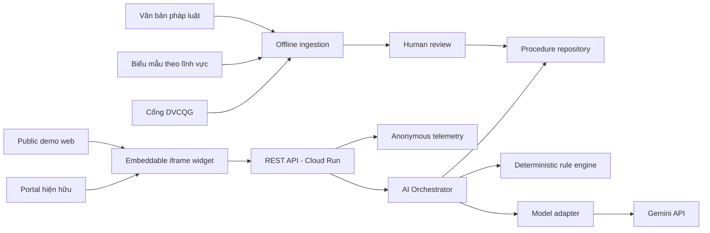

# Architecture, Models và API

## 1. System diagram



## 2. Technology decisions

- Monorepo TypeScript.
- Next.js/React cho demo portal, widget và server API.
- Cloud Run cho public deployment và HTTPS endpoint.
- Gemini 3.5 Flash stable qua provider adapter cho intent, extraction và explanation.
- JSON Schema/Zod cho structured output và request validation.
- Versioned JSON procedure packs; không cần vector database trong MVP.
- OpenTelemetry-compatible structured metrics nhưng không ghi nội dung người dùng.

Model ID là configuration, không hard-code trong business logic. Adapter phải hỗ trợ `route`, `extract` và `explain`, giúp thay provider mà không đổi public API.

## 3. Data flow

### Guided intake

1. Widget gửi message và client-side context.
2. Router trả `procedure_id`, confidence và missing discriminators.
3. Người dùng xác nhận thủ tục và trả lời câu hỏi.
4. Orchestrator chọn đúng procedure pack theo `procedure_id + jurisdiction + version`.
5. Rule engine tính checklist có điều kiện.
6. Explainer diễn đạt dữ liệu đã tính; citation được gắn từ source ID, không do LLM tạo.

### Document checking

1. API kiểm tra MIME, magic bytes, kích thước và số trang.
2. File được truyền trong memory tới model adapter.
3. Extractor trả field, evidence, page và confidence theo schema.
4. Buffer file bị giải phóng; không lưu file hoặc raw extraction trong logs.
5. Người dùng xác nhận/chỉnh trường trên client.
6. Validator áp dụng deterministic rules; semantic checker chỉ bổ sung suspected conflicts.
7. API trả CheckReport cùng rule/source versions.

## 4. Core schemas

```ts
type ProcedureId =
  | "birth-registration"
  | "permanent-residence"
  | "new-private-house-building-permit";

interface SourceRef {
  id: string;
  title: string;
  url: string;
  authority: string;
  jurisdiction: "HN" | "VN";
  effectiveFrom?: string;
  retrievedAt: string;
  contentHash: string;
}

interface ProcedureGuide {
  procedureId: ProcedureId;
  procedureCode: string;
  jurisdiction: "HN";
  title: string;
  eligibility: string[];
  requiredDocuments: DocumentRequirement[];
  steps: GuidanceStep[];
  authority: string;
  channels: SubmissionChannel[];
  processingTime: string;
  fees: FeeRule[];
  warnings: string[];
  sourceVersion: string;
  lastVerifiedAt: string;
  sources: SourceRef[];
}

interface CheckIssue {
  severity: "error" | "warning" | "review";
  code: string;
  field?: string;
  document?: string;
  message: string;
  evidence?: string;
  suggestedFix: string;
  ruleId: string;
  sourceId: string;
  confidence: number;
}

interface CheckReport {
  status: "pass" | "needs_fix" | "needs_review";
  issues: CheckIssue[];
  unknowns: string[];
  ruleVersion: string;
  sourceVersion: string;
  disclaimer: string;
}
```

## 5. REST API

### `GET /v1/procedures`

Trả danh sách thủ tục, jurisdiction, procedure/source version và trạng thái hỗ trợ.

### `POST /v1/intake`

```json
{
  "message": "Tôi muốn làm giấy tờ cho con mới sinh",
  "jurisdiction": "HN",
  "answers": {}
}
```

Response gồm `procedureId`, `confidence`, `needsConfirmation`, `questions[]` và `unsupportedReason`.

### `POST /v1/guidance`

Nhận `procedureId`, jurisdiction và discriminator answers; trả `ProcedureGuide`.

### `POST /v1/check/extract`

Multipart gồm `procedureId` và một file. Response:

```json
{
  "documentType": "birth-declaration-form",
  "fields": {
    "child.fullName": {
      "value": "Nguyễn Minh An",
      "page": 1,
      "evidence": "Họ, chữ đệm, tên: Nguyễn Minh An",
      "confidence": 0.98
    }
  },
  "warnings": []
}
```

### `POST /v1/check/validate`

Nhận procedure, discriminator answers và các trường đã được người dùng xác nhận; trả `CheckReport`.

### `GET /healthz`

Kiểm tra service, procedure pack và model configuration; không thực hiện model inference trong health check thường xuyên.

## 6. Widget contract

```html
<script
  src="https://PUBLIC_URL/widget.js"
  data-api-base="https://PUBLIC_URL/v1"
  data-jurisdiction="HN"
  data-theme="government-light"
  data-locale="vi-VN">
</script>
```

Widget chạy trong iframe sandbox. Parent nhận ba event không chứa PII:

- `haichinh:ready`
- `haichinh:completed` với procedure ID và report status
- `haichinh:error` với request ID và error code

## 7. Security và privacy

- CORS allowlist cho widget hosts; rate limit theo IP/request fingerprint.
- CSP, iframe sandbox, strict schema validation và output encoding.
- File được coi là untrusted input; nội dung file không thể thay system prompt.
- Không dùng raw user text/file trong analytics hoặc prompt debugging production.
- Secret chỉ qua deployment secret manager.
- Demo hiển thị cảnh báo “Chỉ sử dụng dữ liệu mẫu” trước upload.

